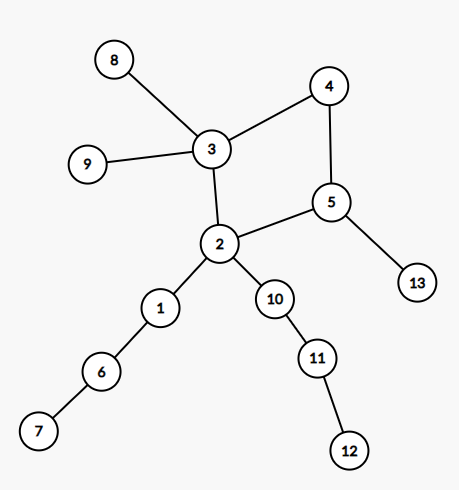
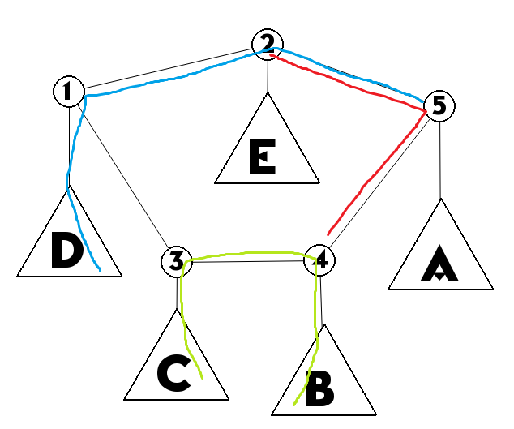
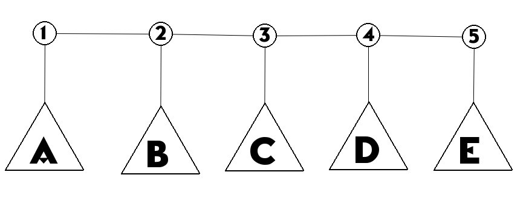
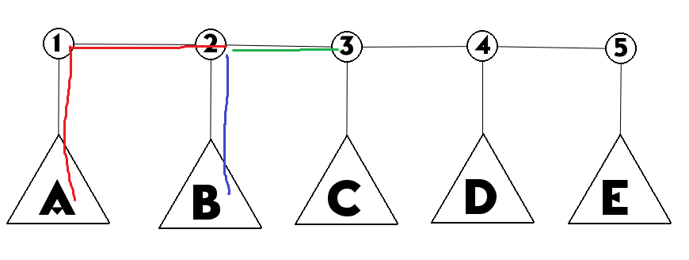
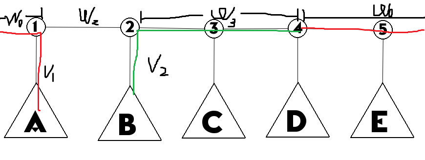

## 题目大意

- 给定一个 $N$ 个点的的有边权（ $L_i$ ）的基环树，求一个点（可以在边上），使其到距离其最远的点的距离最小。
-  $1\leq N \leq 10^5,1 \leq L_i \leq 10^9$ 。

## One Possible Solution :

### 先不考虑基环树的情况，我们思考一下会是个什么情况？

这里有一个比较明显的结论，即：

距离树上某一点最远的点在无负权边的情况下一定可以作为直径的一个端点（两遍 $DFS$ 求树直径的理论基础)。

这个结论转换一下可以变成距离树上某一点最远的点一定是直径的某个端点。

也就是说如果是在普通树上的话，本题答案就是 $\Large \frac{\text{树的直径}}{2}$ 。

想到这里，你光荣的得到了 $0\ pts$ ，~~NOI并没有给普通树的部分分~~。

### 但是在基环树上也是这样的吗？

#### 基环树的直径

在网上我也没找到一个比较官方的对基环树直径的定义，我个人认为其应该是指基环树上两点间最小距离的最大值。

但是此题的话，定义为：

**断掉每一条环上的边分别形成的树的直径的最小值即为基环树的直径。**

如果按照这个定义，容易看出，在基环树上本题的答案还是 $\Large \frac{\text{树的直径}}{2}$ 。

所以经过上面的过程，我们已经成功地将这道题转换成了一个比较模板的算法：求树的直径。

#### 考虑一下如何求基环树的直径

**先在这里说明一下：**

因为基环树可以形象的描述为一个环挂着几颗子树，所以后文的**子树**若无特殊说明都是指环上一个节点及其**联通的不在基环上的节点**构成的子树。

##### 基环树的直径有两种情况：

- 直径未经过环（~~骗分的好数据~~）：

如图，树的直径是 $7\rightarrow 6\rightarrow 1\rightarrow 2\rightarrow 10\rightarrow 11\rightarrow 12$。

- 直径经过了环：

如图，树的直径是 $6\rightarrow 5\rightarrow 4\rightarrow 3\rightarrow 2\rightarrow 7\rightarrow 8$。

先看第一种，它很好解决，直接 $DP$ 求每一个子树的直径，就可以在 $\Omicron(n)$ 的时间复杂度下解决。

**~~显然~~，求树的直径难点是第二种情况，我们先把它抽象化一下变成下图（大写字母标注的是子树）：**

此时树的直径仍有多种可能：

- 直径经过两颗子树（绿线）。
- 直径经过一颗子树（蓝线）。
- 直径端点都在环上（红线）。

这三种情况可以合并，只选一颗子树或不选都其实是选了大小为零的子树。

此时我们求基环树的直径相当于在基环上求：

$$\large Max(\text{任意两个环上点的子树的深度和}+\text{环上这两点最小距离})$$

朴素求法是断环成链，但是这种方法可以被卡成 $\Omicron(n^2)$ 。

#### 如果在考场上想不出来如何求基环树直径，我们就可用暴力加骗分的做法：

对于 $\Omicron(n^2)$ 可过的数据，我们暴力断环成链，求新的树的直径，其所有情况下的最大值即是基环树的直径，然后对于  $\Omicron(n^2)$不可过的，我们直接求出非环上的子树的直径，并把它当作基环树的直径（~~真实骗分~~），预计得分 $60.pts - 100pts$。 

关于 $\Omicron(n^2)$ 算法本人没试过。（但理论上 $60.pts$ 是比较稳的，更多的分数就看出题人给的基环树的直径是不是没有在基环上的边了。）

#### 为了稳拿后面的 $40.pts$ 我们需要求基环树的直径的正解。

##### 考虑如何优化：

断环成链是很难避免的（~~蒟蒻想不出来~~），所以我们先断边形成下图。

环上的距离并不难算，我们定义环上 $1$ 点处距离为 $0$ ,记作 $dis_1$ ,环长 $Len$ 。

则环上 $i,j$ 两点间距离为 $\Large min(Len-|dis_i-dis_j|,|dis_i-dis_j|)$ ,记作 $R_{ij}$ 。

我们记录每颗子树内的最长链为 $dp_i$ 。

注：此处为了方便说明，默认了环上的点的序号是连续的，且从 $1$ 开始至 $n$ 结束，把它扩展到常规情况并不难。

于是我们记录一个数组 $Pre_i$，记录从 $1$ 点开始到当前遍历的环上节点 $j$ 时的 $\Large Max(dp_k+R_{kj}),k \in [1,j)$ 。

（此处是我一开始的思路，后来发现这样不好将统计答案与 $Pre$ 的递推一起做，所以在后面代码中 $Pre$ 记录的是此前的最优决策点。）

如过朴素做，这里仍然是 $\Omicron(n^2)$ 的，因为这里全是正权边，所以这里有一个很简单的决策单调性优化，可以将其化为 $\Omicron(n)$ 。

我们可以通过观察结合计算的方法证明如下：

**情况一**

仔细观察一下上面这张图，图中绿色路径是公共的，若在决策点 $2$ 处时，红色路径短于蓝色路径。而继续走下去，因为沿途都是公共边，所以红色路径就永远不会长于蓝色路径。

**情况二**

上图这种情况就有些麻烦了，一眼看不出来，但是仍然是满足决策单调性的。

上图标记了一些符号，其中 $w_0$ 表示从决策点 $1$ 到决策点 $4$ 的最短路径， $w_2$ 表示从决策点 $1$ 到决策点 $2$ 的最短路径。

决策点 $2$ 是到从决策点 $1$ 决策点 $4$ 时的最优选择，$w_3$ 表示决策点 $2$ 到决策点 $4$ 的最短路径，$v_2,v_1$ 表示其决策点子树的最长链。 

首先由于在 $1$ 点处，我们选择了走那条被断掉的环上的边，所以我们有 $w_0 \leq w_2+w_3 \ (1)$ 。

然后根据情况一我们有 $v_1+w_2 \leq v_2 \ (2)$ 。

我们要判断 $v_2+w_3$ 与 $v_1+w_0$ 的大小情况。

将变换后的 $(1)$ 代入 $(2)$ 即有： $v_2+w_3 \geq v_1+w_0$ 。

故此时决策仍满足单调性。

综合情况一和情况二， $Pre$ 数组的决策满足单调性。

求完 $Pre$ 数组后基环树经过基环的直径就是 $\Large Max(dp_i+Pre_i),i\in [1,n]$ 。

（代码中 $Pre$ 的直径计算是 $\Large Max(dp_i+dp_{Pre_i}+R_{iPre_i})$ 。）

分析一下，不难发现这样就是 $\Omicron(n)$ 的复杂度，成功 $AC$ 。

### 详细代码实现：

**这里并不给出全部代码，只把核心函数单独给出并讲解。**

